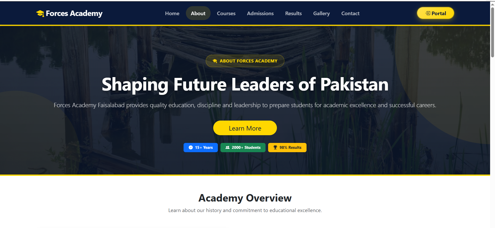
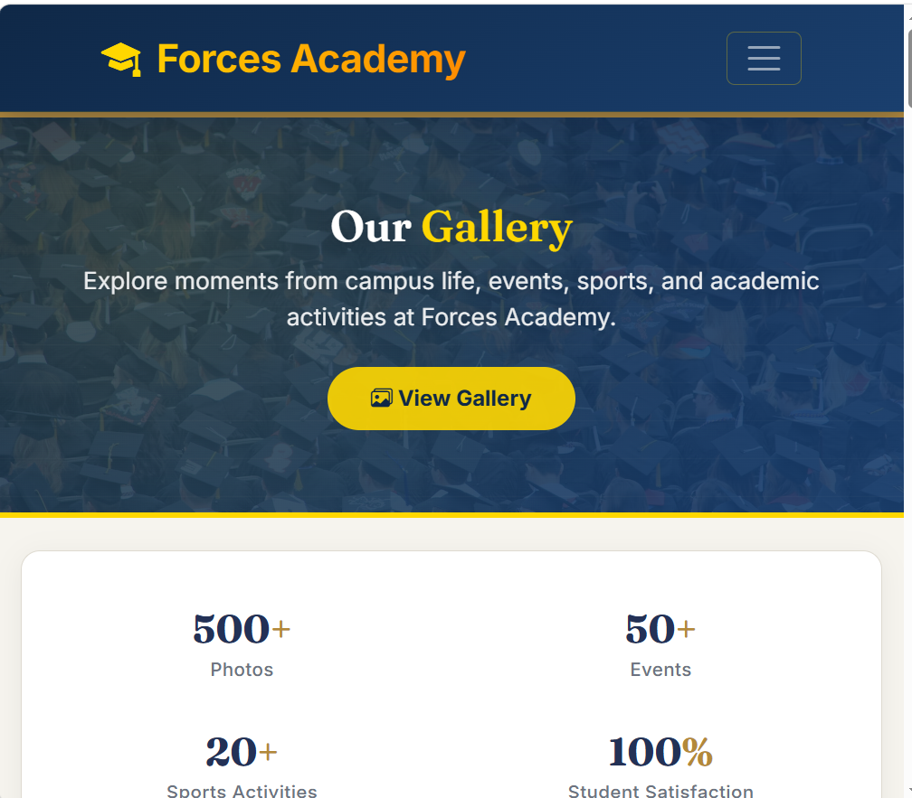
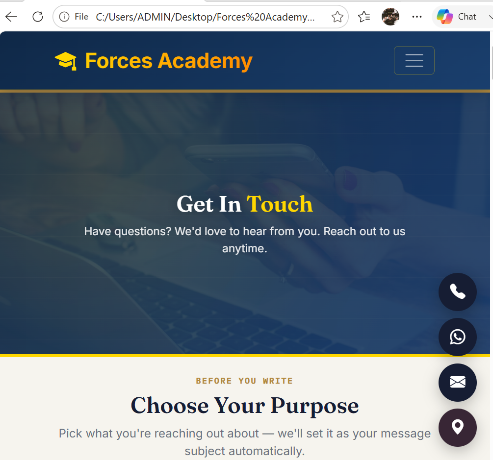

# 🎓 Forces Academy Faisalabad Website

> **A modern, responsive educational website for Forces Academy Faisalabad, designed with a professional navy-blue and gold theme and built using HTML5, CSS3, Bootstrap 5, and Vanilla JavaScript.**

---

## 🌐 **Live Website**

🔗 **GitHub Pages:**  
https://2023-bs-se-004-ui.github.io/Frontend-project-for-Forces-Academy-Faisalabad-website-SI-26-wareesha-/

🔗 **GitHub Repository:**  
https://github.com/2023-bs-se-004-ui/Frontend-project-for-Forces-Academy-Faisalabad-website-SI-26-wareesha-

---

## 📸 **Screenshots**

The project includes screenshots of different pages and features of the website.

### 🏠 **Home Page**


The Home page includes the hero section, academy introduction, statistics, courses, announcements, and important highlights.

---

### ℹ️ **About Page**



The About page presents information about Forces Academy Faisalabad, its educational vision, values, and approach.

---

### 🖼️ **Gallery Page**



The Gallery page showcases campus activities, academy facilities, and images through a responsive gallery layout.

---

### 📞 **Contact Page**



The Contact page provides academy contact information and an enquiry section for visitors.

---

## 🛠️ **Tech Stack**

The following technologies and tools were used to develop this project.

### **Frontend Technologies**

- **HTML5** — Website structure and semantic content
- **CSS3** — Custom styling, animations, and responsive design
- **Bootstrap 5** — Responsive layout and UI components
- **JavaScript (Vanilla JS)** — Interactive website functionality
- **Swiper.js** — Testimonials carousel/slider
- **Font Awesome** — Icons and visual elements
- **Google Fonts** — Website typography

### **Development & Deployment Tools**

- **Git** — Version control
- **GitHub** — Source code hosting
- **GitHub Pages** — Website deployment
- **Visual Studio Code** — Development environment

---

## ✨ **Features**

### 🎨 **Design & User Interface**

- Fully responsive design
- Professional navy-blue, gold, and white color theme
- Modern and clean user interface
- Consistent navbar across all pages
- Consistent footer across all pages
- Sticky navigation bar
- Active-page navigation highlighting
- Responsive mobile navigation menu
- Professional buttons and cards
- Hover effects on buttons and links
- Gallery image hover effects
- Mobile-friendly layout

### 🚀 **Interactive Features**

- Animated hero section
- Smooth entrance animations
- Animated statistics counter
- Smooth scrolling navigation
- Back-to-top button
- Interactive navigation
- Testimonials slider using Swiper.js
- Highlighted Student Portal button
- Responsive navigation menu

### 📚 **Educational Features**

- Detailed course and program cards
- Complete admissions information
- Admission process
- Eligibility requirements
- Required documents
- Fee information
- Student results section
- Campus gallery
- Contact information
- Enquiry section
- Testimonials section

### 📢 **Additional Features**

- Scholarship announcement banner
- Demo class information
- Urgent admission alert banner
- Student Portal access
- Latest announcements section
- Important academy highlights

### 🔍 **SEO & Accessibility**

- SEO-friendly meta descriptions
- Relevant meta keywords
- Open Graph meta tags
- Favicon for browser tab
- Descriptive image `alt` attributes
- Responsive viewport configuration
- Cross-browser compatible layout

---

## 📱 **Responsive Design**

The website is designed to work across different screen sizes and devices.

### **Supported Devices**

- 💻 Desktop
- 📲 Tablet
- 📱 Mobile
- 📱 iPhone
- 📱 Samsung devices
- 📱 iPad

The layout automatically adapts to different screen sizes to provide a consistent and user-friendly experience.

---

## 📄 **Website Pages**

| Page | Description |
|------|-------------|
| 🏠 **Home** | Hero section, introduction, statistics, courses, announcements, and highlights |
| ℹ️ **About** | Academy information, educational vision, values, and approach |
| 📚 **Courses** | Available programs and course details |
| 📝 **Admissions** | Admission process, eligibility, documents, and fee information |
| 📊 **Results** | Student results and academic information |
| 🖼️ **Gallery** | Campus and academy images |
| 📞 **Contact** | Contact information and enquiry section |

---

## 📂 **Project Structure**

```text
Frontend-project-for-Forces-Academy-Faisalabad-website-SI-26-wareesha/
│
├── index.html
├── about.html
├── courses.html
├── admissions.html
├── results.html
├── gallery.html
├── contact.html
│
├── css/
│   └── style.css
│
├── js/
│   └── main.js
│
├── images/
│   ├── home.png
│   ├── about.png
│   ├── gallery.png
│   └── contact.png
│
└── README.md
```

---

## 🚀 **How to Run Locally**

Follow these steps to run the project on your computer.

### **1. Clone the Repository**

Open **Git Bash** or the **VS Code Terminal** and run:

```bash
git clone https://github.com/2023-BS-SE-004-UI/Frontend-project-for-Forces-Academy-Faisalabad-website-SI-26-wareesha-.git
```

### **2. Open the Project Folder**

Move into the project directory:

```bash
cd Frontend-project-for-Forces-Academy-Faisalabad-website-SI-26-wareesha-
```

### **3. Open the Project in VS Code**

Run:

```bash
code .
```

Alternatively, open the project folder manually in Visual Studio Code.

### **4. Run the Website**

Open:

```text
index.html
```

in your web browser.

### **Recommended: Live Server**

For a better development experience:

1. Install the **Live Server** extension in VS Code.
2. Open `index.html`.
3. Right-click the file.
4. Select **Open with Live Server**.

Or click:

```text
Go Live
```

The website will then open automatically in your browser.

---

## 🌍 **Deployment**

This project is deployed using **GitHub Pages**.

### **GitHub Pages Configuration**

- **Source:** Deploy from a branch
- **Branch:** `main`
- **Folder:** `/ (root)`

### **How to Deploy**

1. Push the project to GitHub.
2. Open the repository on GitHub.
3. Go to **Settings**.
4. Select **Pages**.
5. Under **Build and deployment**, select **Deploy from a branch**.
6. Select the `main` branch.
7. Select `/ (root)`.
8. Click **Save**.

GitHub will automatically generate the live website link.

---

## 🔄 **Git Workflow**

After making changes to the website, use the following commands:

```bash
git add .
```

```bash
git commit -m "Update website"
```

```bash
git push origin main
```

The changes will be uploaded to the GitHub `main` branch.

---

## ✅ **Quality Checklist**

- [x] Responsive layout
- [x] Consistent navbar across all pages
- [x] Consistent footer across all pages
- [x] Unified typography
- [x] Unified navy-blue and gold color theme
- [x] Hover effects on buttons and links
- [x] Gallery hover effects
- [x] Student Portal button highlighted
- [x] Mobile responsive
- [x] Tablet responsive
- [x] Desktop responsive
- [x] Cross-browser compatible
- [x] SEO meta tags added
- [x] Open Graph meta tags added
- [x] Favicon added
- [x] Descriptive image `alt` attributes
- [x] Git version control
- [x] GitHub repository
- [x] GitHub Pages deployment completed

---

## 🎯 **Project Purpose**

The purpose of this project is to create a **modern, responsive, and user-friendly educational website for Forces Academy Faisalabad**.

The project demonstrates practical frontend development skills including:

- Responsive web design
- HTML5 and CSS3
- Bootstrap components
- JavaScript interactivity
- CSS animations
- UI/UX design
- SEO basics
- Git version control
- GitHub repository management
- GitHub Pages deployment

---

## 👩‍💻 **Built By**

### **Wareesha Atif**

**Code Saviours — SI-26 Frontend Track**  
**2026**

---

## 🏆 **Internship Project**

This project was developed as part of the:

**Code Saviours SI-26 Frontend Track — 2026**

The project demonstrates the practical application of frontend development concepts learned during the internship.

---

## ⭐ **Thank You**

Thank you for visiting the **Forces Academy Faisalabad Website**.

⭐ If you like this project, feel free to explore the repository and live website.